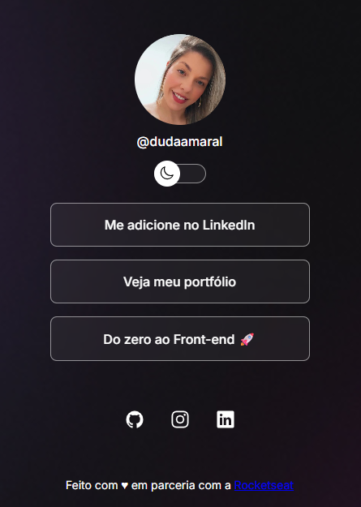

🌐 DevLinks | Duda Amaral
Um projeto de link na bio responsivo com alternância de tema (light/dark), desenvolvido para centralizar minhas redes e conteúdos em uma interface moderna e elegante.

## 🚀 Preview

✨ Funcionalidades
🌗 Alternância entre modo claro e escuro

🎨 Tema dinâmico com variáveis CSS

📱 Layout responsivo para mobile

🔗 Centralização de links importantes

💎 Efeito glassmorphism (fundo com blur)

🛠️ Tecnologias
HTML5 / CSS3

JavaScript (Manipulação de DOM)

Ionicons / Google Fonts

⚙️ Como funciona o tema
A troca de tema é feita via JavaScript, alternando a classe light no <html>. O CSS então reage a essa classe para mudar as variáveis de cor:

JavaScript
function toggleMode() {
  const html = document.documentElement
  html.classList.toggle("light")
}
